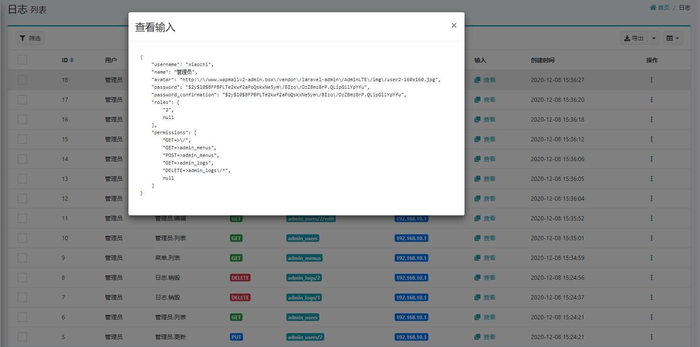

# operation-log utils for laravel-admin

## preview



## install

```shell
composer require laravel-admin-utils/operation-logs
```

## publish resources

```shell script
php artisan vendor:publish --provider="Elegant\Utils\OperationLog\OperationLogServiceProvider"
```

## initialize

```shell script
php artisan operation-log:init
```

open the link http://localhost/auth/logs
